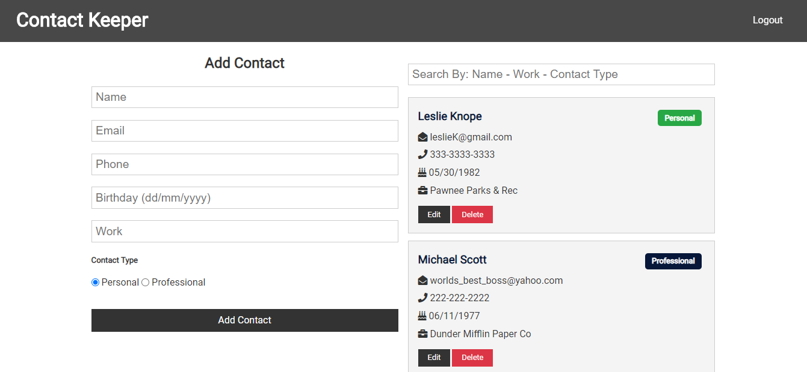
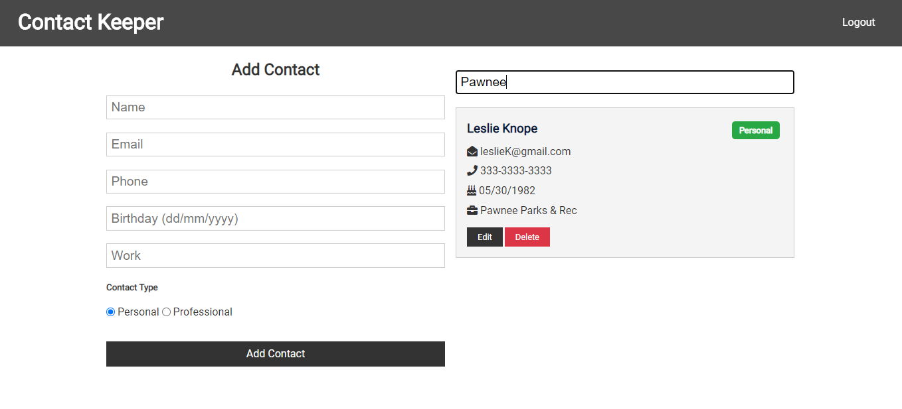
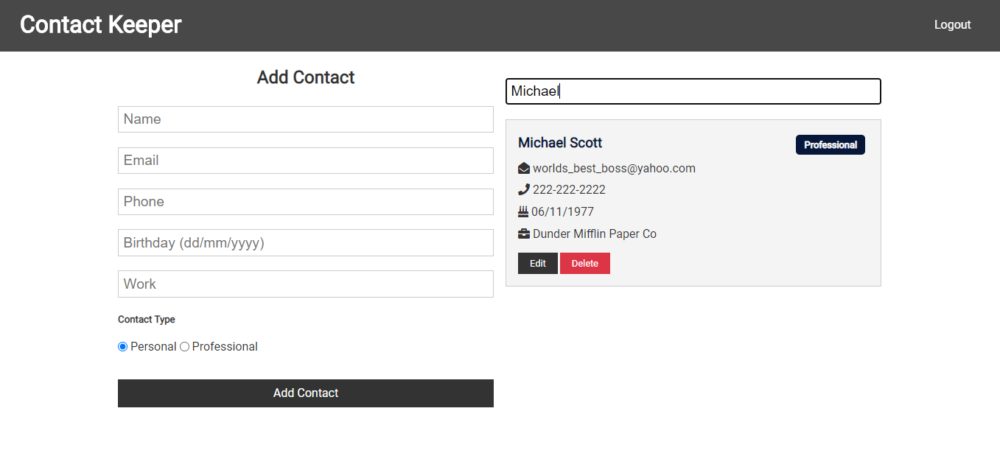

# Contact-Keeper

## About

This is a MERN (MongoDB, Express, React, Node) stack application where you can add, edit and delete personal or professional contacts.

#### Filter and Search Contacts By Name, Work and Whether It's A Professional Or Personal Contact

## Technologies Used

### Back End

<li>Mongo DB</li>
<li>Express</li>
<li>Node.js</li>
<li>Postman</li>

### Front End

<li>React</li>
<li>uuid - (Assigning an id before connecting to Mongo DB)</li>
<li>React-Transition-Group - For fading when adding or deleting a contact</li>

### Authorization

<li>bcryptjs</li>
<li>JSON Web Token</li>
<li>Express-Validator</li>

## Future Development

<li>Styling</li>
<li>Calendar Page</li>
<li>Birthday Alert</li>
